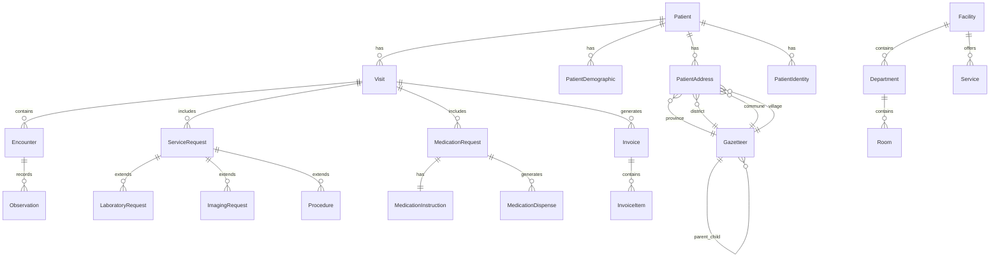

# Design Document

## Overview

This design document outlines the technical architecture for a comprehensive Electronic Medical Record (EMR) API system built on Laravel framework with FHIR-inspired standards. The system leverages existing database structures and extends them to support complete clinical workflows from patient registration through discharge, including comprehensive data export capabilities.

The system is API-only with no user interface requirements, focusing on providing RESTful endpoints for healthcare applications to manage patient data, clinical encounters, medications, service requests, billing, and facility operations.

## Architecture

### API Versioning Strategy

The API uses URL-based versioning with the following approach:

- **Current Version**: v1 (e.g., `/api/v1/patients`)
- **Version Format**: `/api/v{major}/resource`
- **Backward Compatibility**: Maintain previous versions for at least 12 months
- **Version Headers**: Optional `Accept: application/vnd.emr.v1+json` header support
- **Deprecation**: Clear deprecation notices and migration guides

**Version Management**:
```php
// Route grouping by version
Route::prefix('v1')->group(function () {
    Route::apiResource('patients', PatientController::class);
    // ... other v1 routes
});

Route::prefix('v2')->group(function () {
    // Future v2 routes
});
```

### High-Level Architecture

The system follows a clean architecture pattern with Action-based design built on Laravel framework:

```
┌─────────────────────────────────────────┐
│              API Layer                  │
│  (Controllers, Resources, Middleware)   │
├─────────────────────────────────────────┤
│            Action Layer                 │
│     (Single Responsibility Actions)     │
├─────────────────────────────────────────┤
│            Service Layer                │
│   (Business Logic, Validation)          │
├─────────────────────────────────────────┤
│             Model Layer                 │
│    (Eloquent Models, Relationships)     │
├─────────────────────────────────────────┤
│            Database Layer               │
│  (PostgreSQL, Existing Schema + Extensions) │
└─────────────────────────────────────────┘
```

### Action-Based Design Pattern

The system uses Action classes for single-responsibility operations:

- **Actions**: Single-purpose classes that handle specific operations (e.g., `CreatePatientAction`, `DischargePatientAction`)
- **Services**: Coordinate multiple actions and handle complex business logic
- **Controllers**: Thin layer that delegates to actions and returns responses

### Technology Stack

- **Framework**: Laravel 12.x
- **Database**: PostgreSQL with existing schema
- **Authentication**: Laravel Passport (OAuth2)
- **API Documentation**: Scramble (OpenAPI/Swagger)
- **Query Building**: Spatie Laravel Query Builder
- **Permissions**: Spatie Laravel Permission
- **Activity Logging**: Spatie Laravel Activity Log
- **Testing**: PHPUnit with Feature/Unit tests

## Components and Interfaces

### 1. Patient Management Component

**Purpose**: Manages comprehensive patient information including demographics, insurance, and addressing.

**Key Classes**:
- `PatientController`: API endpoints for patient CRUD operations
- `PatientService`: Business logic coordination
- **Actions**:
  - `CreatePatientAction`: Handle patient creation with demographics
  - `UpdatePatientAction`: Update patient information
  - `SearchPatientsAction`: Search patients with filters
  - `GetPatientDetailsAction`: Retrieve complete patient data
- `Patient`, `PatientDemographic`, `PatientAddress`, `PatientIdentity` models

**API Endpoints** (v1):
```
POST   /api/v1/patients                    # Create patient
GET    /api/v1/patients                    # List patients with search
GET    /api/v1/patients/{id}               # Get patient details
PUT    /api/v1/patients/{id}               # Update patient
DELETE /api/v1/patients/{id}               # Soft delete patient
GET    /api/v1/patients/{id}/visits        # Get patient visit history
```

### 2. Address Management Component

**Purpose**: Provides Cambodia gazetteer-based address management with hierarchical selection.

**Key Classes**:
- `GazetteerController`: API endpoints for address data
- `GazetteerService`: Address validation and hierarchy logic
- **Actions**:
  - `GetProvincesAction`: Retrieve all provinces
  - `GetDistrictsByProvinceAction`: Get districts for province
  - `GetCommunesByDistrictAction`: Get communes for district
  - `GetVillagesByCommuneAction`: Get villages for commune
- `Gazetteer` model with self-referencing relationships

**API Endpoints** (v1):
```
GET /api/v1/gazetteers/provinces           # Get all provinces
GET /api/v1/gazetteers/districts/{province_id}  # Get districts by province
GET /api/v1/gazetteers/communes/{district_id}   # Get communes by district
GET /api/v1/gazetteers/villages/{commune_id}    # Get villages by commune
```

### 3. Facility Management Component

**Purpose**: Manages healthcare facilities, departments, rooms, and services.

**Key Classes**:
- `FacilityController`, `DepartmentController`, `RoomController`, `ServiceController`
- `FacilityService`: Business logic coordination
- **Actions**:
  - `GetFacilitiesAction`: List all facilities
  - `GetFacilityDepartmentsAction`: Get departments for facility
  - `GetDepartmentRoomsAction`: Get rooms for department
  - `CheckRoomAvailabilityAction`: Verify room availability
- `Facility`, `Department`, `Room`, `Service` models

**API Endpoints** (v1):
```
GET    /api/v1/facilities                  # List facilities
GET    /api/v1/facilities/{id}/departments # Get facility departments
GET    /api/v1/departments/{id}/rooms      # Get department rooms
GET    /api/v1/rooms/{id}/availability     # Check room availability
```

### 4. Clinical Workflow Component

**Purpose**: Manages patient visits, encounters, and clinical documentation.

**Key Classes**:
- `VisitController`, `EncounterController`
- `ClinicalWorkflowService`: Visit and encounter coordination
- **Actions**:
  - `AdmitPatientAction`: Create visit and initial encounter
  - `DischargePatientAction`: Complete visit with discharge details
  - `CreateEncounterAction`: Add new encounter to visit
  - `TransferPatientAction`: Create transfer encounter
  - `GetEncounterDetailsAction`: Retrieve encounter information
- `Visit`, `Encounter` models with comprehensive relationships

**API Endpoints** (v1):
```
POST   /api/v1/visits                      # Create visit (admission)
PUT    /api/v1/visits/{id}/discharge       # Discharge patient
POST   /api/v1/visits/{id}/encounters      # Create encounter
GET    /api/v1/encounters/{id}             # Get encounter details
POST   /api/v1/encounters/{id}/transfer    # Transfer patient
```

### 5. Medication Management Component

**Purpose**: Handles complete medication lifecycle from prescription to administration.

**Key Classes**:
- `MedicationController`, `PrescriptionController`
- `MedicationService`: Prescription coordination
- **Actions**:
  - `CreatePrescriptionAction`: Generate medication prescription
  - `DispenseMedicationAction`: Record medication dispensing
  - `GetMedicationHistoryAction`: Retrieve patient medication history
  - `ValidateMedicationAction`: Check for allergies and interactions
- `MedicationRequest`, `MedicationInstruction`, `MedicationDispense` models

**API Endpoints** (v1):
```
POST   /api/v1/visits/{id}/prescriptions   # Create prescription
GET    /api/v1/prescriptions/{id}          # Get prescription details
POST   /api/v1/medications/{id}/dispense   # Record medication dispense
GET    /api/v1/patients/{id}/medications   # Get medication history
```

### 6. Service Request Component

**Purpose**: Manages laboratory tests, imaging studies, and procedures.

**Key Classes**:
- `ServiceRequestController`, `LaboratoryController`, `ImagingController`
- `ServiceRequestService`: Request coordination
- **Actions**:
  - `CreateServiceRequestAction`: Generate lab/imaging/procedure requests
  - `UpdateServiceResultsAction`: Record test results
  - `GetPendingRequestsAction`: Retrieve outstanding requests
  - `CompleteServiceRequestAction`: Mark request as completed
- `ServiceRequest`, `LaboratoryRequest`, `ImagingRequest`, `Procedure` models

**API Endpoints** (v1):
```
POST   /api/v1/visits/{id}/service-requests    # Create service request
GET    /api/v1/service-requests/{id}           # Get request details
PUT    /api/v1/service-requests/{id}/results   # Update with results
GET    /api/v1/visits/{id}/pending-requests    # Get pending requests
```

### 7. Billing Component

**Purpose**: Generates invoices based on services and patient insurance coverage.

**Key Classes**:
- `InvoiceController`, `BillingController`
- `BillingService`: Invoice coordination
- **Actions**:
  - `GenerateInvoiceAction`: Create invoice for visit services
  - `CalculateDiscountsAction`: Apply insurance discounts
  - `RecordPaymentAction`: Process payment transactions
  - `GetBillingHistoryAction`: Retrieve patient billing records
- `Invoice`, `InvoiceItem` models

**API Endpoints** (v1):
```
POST   /api/v1/visits/{id}/invoices        # Generate invoice
GET    /api/v1/invoices/{id}               # Get invoice details
PUT    /api/v1/invoices/{id}/payment       # Record payment
GET    /api/v1/patients/{id}/billing       # Get billing history
```

### 8. Clinical Forms and Observation Component

**Purpose**: Manages structured clinical forms with dynamic schemas and converts form data to FHIR-compliant observations.

**Existing Implementation Features**:
- **Dynamic Form Schema**: JSON-based form definitions with sections, fields, validation rules
- **FHIR Mapping**: Automatic conversion of form data to FHIR observations
- **Form Categories**: Vital signs, physical examination, medical history, etc.
- **Validation Engine**: Built-in field validation based on form schema
- **Form Management**: Create, update, activate/deactivate, duplicate forms
- **Usage Analytics**: Form statistics and usage tracking

**Key Classes**:
- `ClinicalFormController`: Complete form template management (already implemented)
- `ObservationController`: Clinical observation management
- `ClinicalFormService`: Form processing coordination
- **Actions**:
  - `CreateFormTemplateAction`: Generate new form templates
  - `ProcessFormSubmissionAction`: Convert form data to observations
  - `ValidateFormDataAction`: Validate against form schema
  - `GenerateObservationsAction`: Create FHIR observations from form data
  - `GetFormStatisticsAction`: Retrieve form usage analytics
- `ClinicalFormTemplate`, `Observation` models (already implemented)

**Form Schema Structure**:
```json
{
  "version": "1.0",
  "sections": [
    {
      "id": "basic_vitals",
      "title": "Basic Vital Signs",
      "fields": [
        {
          "id": "temperature",
          "type": "number_field",
          "label": "Body Temperature",
          "required": true,
          "min_value": 35.0,
          "max_value": 45.0,
          "unit": "°C"
        }
      ]
    }
  ]
}
```

**FHIR Mapping Structure**:
```json
{
  "field_mappings": {
    "temperature": {
      "observation_concept_id": 1,
      "value_field": "value_number",
      "body_site_id": null
    }
  },
  "default_values": {
    "observation_status_id": 1
  }
}
```

**API Endpoints** (v1):
```
# Form Template Management (Already Implemented)
GET    /api/v1/clinical-forms                  # List form templates
POST   /api/v1/clinical-forms                  # Create form template
GET    /api/v1/clinical-forms/{id}             # Get form template
PUT    /api/v1/clinical-forms/{id}             # Update form template
DELETE /api/v1/clinical-forms/{id}             # Delete form template
POST   /api/v1/clinical-forms/{id}/duplicate   # Duplicate form template
PUT    /api/v1/clinical-forms/{id}/activate    # Activate form template
PUT    /api/v1/clinical-forms/{id}/deactivate  # Deactivate form template
GET    /api/v1/clinical-forms/{id}/preview     # Preview form template
GET    /api/v1/clinical-forms/statistics       # Get form statistics

# Form Data Processing (To be implemented)
POST   /api/v1/encounters/{id}/forms           # Submit form data
GET    /api/v1/encounters/{id}/observations    # Get encounter observations
GET    /api/v1/patients/{id}/observations      # Get patient observations
GET    /api/v1/patients/{id}/vitals            # Get patient vital signs
```

### 9. Data Export Component

**Purpose**: Provides comprehensive JSON export matching visit-sample.json structure.

**Key Classes**:
- `ExportController`
- `VisitExportService`: Data aggregation coordination
- **Actions**:
  - `ExportVisitAction`: Generate comprehensive visit JSON
  - `ExportPatientVisitsAction`: Export all patient visits
  - `BulkExportAction`: Handle multiple visit exports
  - `ValidateExportFormatAction`: Ensure JSON structure compliance
- `VisitExportResource`: JSON transformation

**API Endpoints** (v1):
```
GET    /api/v1/visits/{id}/export          # Export single visit
GET    /api/v1/patients/{id}/export        # Export all patient visits
POST   /api/v1/exports/bulk                # Bulk export multiple visits
```

## Data Models

### Core Entity Relationships



### Clinical Form Template Architecture

The system includes a sophisticated clinical form management system with the following features:

**Form Schema Engine**:
- JSON-based dynamic form definitions
- Support for multiple field types (number, text, date, select, etc.)
- Built-in validation rules and constraints
- Multi-section forms with flexible layouts
- Field dependencies and conditional logic

**FHIR Integration**:
- Automatic mapping of form fields to FHIR observation concepts
- Support for different value types (string, number, datetime, complex)
- FHIR observation category mapping
- Standardized terminology integration

**Form Categories** (Already Seeded):
- **Vital Signs**: Temperature, blood pressure, pulse, respiratory rate, SpO2
- **Physical Examination**: System-based examination forms
- **Medical History**: Comprehensive history taking forms
- **Custom Forms**: User-defined clinical assessment forms

**Observation Generation**:
The `ClinicalFormTemplate` model includes a `generateObservations()` method that:
1. Takes form submission data
2. Maps fields to FHIR observation concepts using `fhir_mapping`
3. Creates standardized `Observation` records
4. Links observations to encounters and patients

**Form Validation**:
Dynamic validation rules generated from form schema:
- Required field validation
- Data type validation (numeric, date, email)
- Range validation (min/max values)
- Custom validation rules per field type

### Key Model Extensions

**Patient Model Enhancements**:
```php
class Patient extends Model
{
    protected $fillable = [
        'code', 'facility_id'
    ];
    
    public function demographics() { return $this->hasOne(PatientDemographic::class); }
    public function addresses() { return $this->hasMany(PatientAddress::class); }
    public function identities() { return $this->hasMany(PatientIdentity::class); }
    public function visits() { return $this->hasMany(Visit::class); }
    public function activeInsurance() { /* Logic for active insurance */ }
}
```

**Visit Model Enhancements**:
```php
class Visit extends Model
{
    protected $fillable = [
        'patient_id', 'facility_id', 'visit_type_id', 'admission_type_id',
        'admitted_at', 'discharged_at', 'discharge_type_id', 'visit_outcome_id'
    ];
    
    public function encounters() { return $this->hasMany(Encounter::class); }
    public function medicationRequests() { return $this->hasMany(MedicationRequest::class); }
    public function serviceRequests() { return $this->hasMany(ServiceRequest::class); }
    public function invoices() { return $this->hasMany(Invoice::class); }
}
```

**ClinicalFormTemplate Model** (Already Implemented):
```php
class ClinicalFormTemplate extends Model
{
    protected $fillable = [
        'name', 'title', 'description', 'category', 'fhir_observation_category',
        'form_schema', 'fhir_mapping', 'active'
    ];
    
    protected $casts = [
        'fhir_observation_category' => 'array',
        'form_schema' => 'array',
        'fhir_mapping' => 'array',
        'active' => 'boolean'
    ];
    
    public function encounters() { return $this->hasMany(Encounter::class); }
    public function generateObservations(array $formData, int $encounterId, int $patientId): array;
    public function getValidationRules(): array;
}
```

**Encounter Model Enhancements**:
```php
class Encounter extends Model
{
    public function clinicalFormTemplate() { return $this->belongsTo(ClinicalFormTemplate::class); }
    public function observations() { return $this->hasMany(Observation::class); }
    public function visit() { return $this->belongsTo(Visit::class); }
}
```

## Error Handling

### API Error Response Structure

```json
{
    "error": {
        "code": "VALIDATION_ERROR",
        "message": "The given data was invalid.",
        "details": {
            "field_name": ["Specific validation error message"]
        },
        "trace_id": "uuid-for-tracking"
    }
}
```

### Error Categories

1. **Validation Errors** (400): Invalid input data
2. **Authentication Errors** (401): Invalid or missing authentication
3. **Authorization Errors** (403): Insufficient permissions
4. **Not Found Errors** (404): Resource not found
5. **Conflict Errors** (409): Business rule violations
6. **Server Errors** (500): Internal system errors

### Error Handling Strategy

- Use Laravel's built-in validation with custom form requests
- Implement global exception handler for consistent error responses
- Log all errors with appropriate context for debugging
- Provide meaningful error messages for API consumers
- Include trace IDs for error tracking and support

## Testing Strategy

### Test Structure

```
tests/
├── Feature/
│   ├── Api/
│   │   ├── V1/
│   │   │   ├── PatientManagementTest.php
│   │   │   ├── ClinicalWorkflowTest.php
│   │   │   ├── MedicationManagementTest.php
│   │   │   ├── ServiceRequestTest.php
│   │   │   ├── BillingTest.php
│   │   │   └── DataExportTest.php
├── Unit/
│   ├── Actions/
│   │   ├── CreatePatientActionTest.php
│   │   ├── AdmitPatientActionTest.php
│   │   └── ...
│   ├── Services/
│   └── Models/
└── Integration/
    └── FullWorkflowTest.php
```

### Testing Approach

1. **Unit Tests**: Test individual components in isolation
   - Action classes single responsibility logic
   - Service classes coordination logic
   - Model relationships and methods

2. **Feature Tests**: Test complete API endpoints with versioning
   - HTTP request/response cycles for v1 endpoints
   - Authentication and authorization
   - Database interactions
   - JSON response structure validation

3. **Integration Tests**: Test complete workflows
   - Patient admission to discharge
   - Medication prescription to administration
   - Service request to result recording
   - Invoice generation and payment

### Test Data Strategy

- Use Laravel factories for consistent test data generation
- Create realistic test scenarios based on visit-sample.json
- Implement database transactions for test isolation
- Use in-memory SQLite for faster test execution

### Coverage Goals

- Minimum 80% code coverage
- 100% coverage for critical business logic
- All API endpoints must have feature tests
- All service methods must have unit tests

## Security Considerations

### Authentication & Authorization

- OAuth2 implementation via Laravel Passport
- Role-based access control using Spatie Laravel Permission
- API rate limiting to prevent abuse
- Request validation and sanitization

### Data Protection

- Sensitive patient data encryption at rest
- HTTPS enforcement for all API communications
- Audit logging for all data access and modifications
- Compliance with healthcare data protection standards

### API Security

- Input validation and sanitization
- SQL injection prevention through Eloquent ORM
- XSS protection through proper output encoding
- CSRF protection for state-changing operations

This design provides a robust foundation for implementing the comprehensive EMR system while leveraging the existing Laravel infrastructure and database schema.